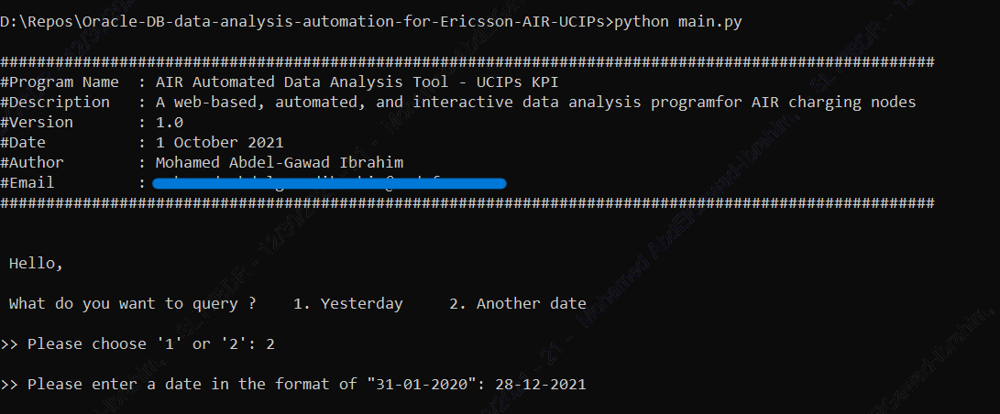

# Oracle Database Data Analysis Automation for Ericsson AIR UCIPs KPI

## Project Overview

Disclaimer: All datasets in this project have been manipulated and don't represent real data.

A data analysis tool that acquire the data from Oracle database then perform complex data analysis operations to print final insights regarding UCIPs KPI of Ericsson AIR system.

The tool acquire two datasets from two oracle database tables: 
* First dataset is daily 46 Columns X 49,000 Rows.
* Second dataset is daily 68 Columns X 48,000 Rows

## Challenges
The assessment includes multiplying each value in the table by some factor. The factor of each cell/value is specified by the column type and the node column of the same value.

After checking each column, we need to loop over rows, and check the node of each record; then check the Gen number (a characteristic of the node) and based on its Gen Number we decide the value to be multiplied by that record.

We do this for both datasets; then we sum all columns to obtain the total weighted transactions per second for that day.

Before writing this tool, it would take very very long hours to complete such assessment.

After writing this tool, it takes only seconds to complete the full assessment and displays the final assessment in the terminal.

## Main Features
* Acquire two data sets (daily 49,000 rows X 46 columns and daily 48,000 rows X 68 columns) from the Oracle database.

* Weight each column by a different factor according to each node characteristic.

* Merge both datasets and combine all weighted columns in one total column.

* Analyze the final dataset and calculate the maximum utilization percentage in each pool of nodes (nodes are divided in three categories/pools).

* Save each step of the data analysis automation process in .csv file.

## What Software Did I Need?

To complete this project, I used the following software:

* Python [pandas, numpy, sqlalchemy, time, datetime, sys]
* A text editor: VS Code
* Version Control with Git

## Screenshots

## About The Author

* Author: Mohamed Abdel-Gawad Ibrahim
* Contact: muhammadabdelgawwad@gmail.com
* Phone: +201069052620 || +201147821232
